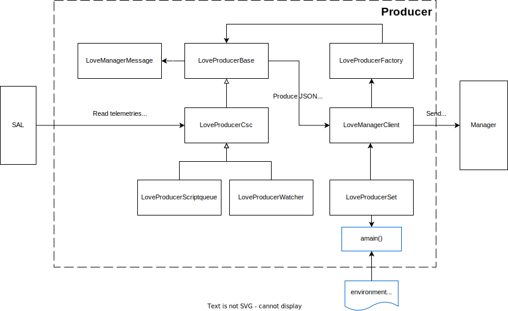

..
    This file is part of LOVE-manager.
..
    Copyright (c) 2023 Inria Chile.
..
    Developed for Inria Chile.
..
    This program is free software: you can redistribute it and/or modify it under 
    the terms of the GNU General Public License as published by the Free Software 
    Foundation, either version 3 of the License, or at your option any later version.
..
    This program is distributed in the hope that it will be useful,but WITHOUT ANY
    WARRANTY; without even the implied warranty of MERCHANTABILITY or FITNESS FOR 
    A PARTICULAR PURPOSE. See the GNU General Public License for more details.
..
    You should have received a copy of the GNU General Public License along with 
    this program. If not, see <http://www.gnu.org/licenses/>.

*****************************
How it works
*****************************

The LOVE-Producer base code consists of several python classes (:code:`LoveManagerClient`, :code:`LoveManagerMessage`, :code:`LoveProducerBase`, :code:`LoveProducerCSC`, :code:`LoveProducerFactory` and :code:`LoveProducerSet`).
Also there are special classes for custom CSC behavior: :code:`LoveProducerScriptqueue` and :code:`LoveProducerWatcher`.

LoveManagerClient
#################

The :code:`LoveManagerClient` class is in charge of handling the communication with the LOVE-manager.
This class is responsible of three things:

- Handle connections by generating a websocket client to the LOVE-manager server.
- Send messages to the LOVE-manager through the websocket client.
- Create one or more producers of choice by using the :code:`LoveProducerFactory` class.

LoveManagerMessage
##################

The :code:`LoveManagerMessage` class is used to create messages to be sent to the LOVE-manager.
Messages can be of two types: subscription and data.

Subscription messages are used to subscribe to a specific channel which the LOVE-manager will use when a new client connects to tell the producer to send the specificied stream data.
This is done by sending a message with the following structure:

.. code-block::

    {
        "option": "subscribe",
        "category": "initial_state",
        "csc": "ScriptQueue",
        "salindex": 'all',
        "stream": "availableScripts",
        "producer_snd": 1690852640
    }

Data messages are used to send the data of a stream to the LOVE-manager.
These messages have the following structure:

.. code-block::

    {
        "category": "event",
        "data": [
            {
                "csc": "ScriptQueue",
                "salindex": 1,
                "data": {
                    "availableScripts": {
                        "standard": { ... },
                        "external": { ... }
                    },
                }
            }
        ]
    }

.. TODO: add details about: attributes, constructor, special methods, and code example.

LoveProducerBase
################

The :code:`LoveProducerBase` class provides the basic behavior to produce messages to be sent through the :code:`LoveManagerClient`.
It can be used as a generic template to create new producers with custom behavior to read data from SAL (or even other source).
It is responsible of the following things:

- Sets the component which will be monitored.
- Defines the :code:`send_message` method to send messages to the LOVE-manager.
- Runs a task to periodic monitoring telemetries and defines callbacks for asynchronous events.
- Provides structures to store the data to be sent to the LOVE-manager.

.. TODO: add details about: attributes, constructor, special methods, and code example.

LoveProducerCSC
###############

The :code:`LoveProducerCSC` class inherits from :code:`LoveProducerBase`.
It provides the basic functionality for CSC connection by using the :code:`salobj` library to read telemetries and events from the specified CSC.
Then it collects the data and produces the messages to be sent through the :code:`LoveManagerClient`.

.. TODO: add details about: attributes, constructor, special methods, and code example.

LoveProducerScriptqueue
#######################

The :code:`LoveProducerScriptqueue` class inherits from :code:`LoveProducerCSC`.
It provides custom functionality to read data from the ScriptQueue CSC.
It gerenates a custom message to be sent to the LOVE-manager, which contains the following data:

.. code-block::

    {
        "category": "event",
        "data": [
            {
                "csc": "ScriptQueueState",
                "salindex": 1,
                "data": {
                    "stream": {
                        "enabled": true,
                        "running": false,
                        "waitingIndices": [ ... ],
                        "finishedIndices": [ ... ],
                        "currentIndex": 0,
                        "available_scripts": { ... },
                        "finished_scripts": { ... },
                        "waiting_scripts": { ... }
                    }
                }
            }
        ]
    }

It also provides methods to send ScriptQueue heartbeats back to the LOVE-manager.

LoveProducerWatcher
###################

The :code:`LoveProducerWatcher` class inherits from :code:`LoveProducerCSC`.
It provides custom functionality to read data from the Watcher CSC.
It generates a custom message to be sent to the LOVE-manager, which contains the following data:

.. code-block::

    {
        "category": "event",
        "data": [
            {
                "csc": "Watcher",
                "salindex": 0,
                "data": {
                    "stream": {
                        "alarms": { ... }
                    }
                }
            }
        ]
    }

LoveProducerFactory
###################

The :code:`LoveProducerFactory` class was implemented using the `factory patter` to instantiate different types of producers.
It provides two static methods:

- :code:`get_love_producer_from_type`: to create a producer by setting the type: :code:`base`, :code:`csc`, :code:`scriptqueue`, :code:`watcher`.
- :code:`get_love_producer_from_name`: to create a producer by setting the name and salindex of the CSC in the form :code:`<CSC>:<salindex>`.

LoveProducerSet
###############

The `LoveProducerSet` class is used to run the LOVE-producer code, by creating a LOVE-manager client and a set of producers.
It also calls the :code:`salobj.Domain` method to configure the lsst domain.

It provides the :code:`run_love_producer` method to run the configured producers using :code:`asyncio`.
This method is a wrapper of the :code:`amain` one, which is the one that actually reads the params and runs the producers.
It receives the following params:

- :code:`components`: list of CSCs to be monitored, e.g. `ATDome, ATDomeTrajectory, MTHexapod:1`.
- :code:`log_level`: log level to be used by the LOVE-producer.
