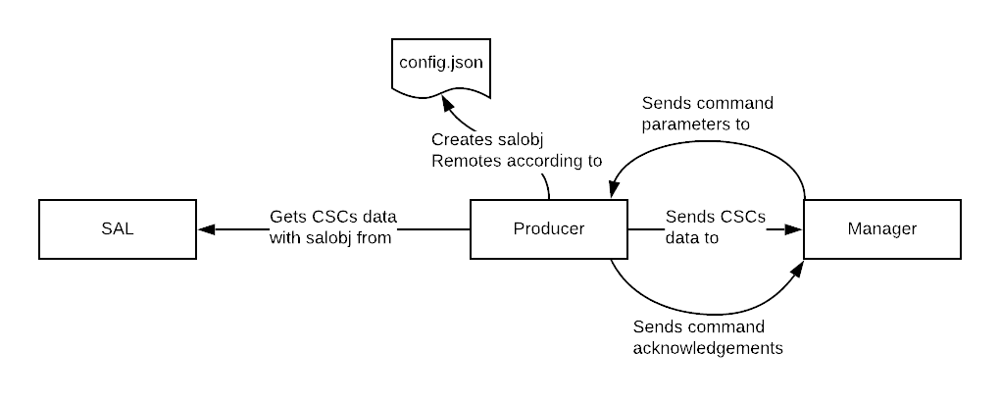

Overview
===============

The LOVE-producer is a python module that uses salobj and websockets to produce messages between SAL and the LOVE-manager. "Messages" can be understood without distinction as events, telemetries or commands parameters and their acknowledgements. The LOVE-producer (or just the Producer) is part of the LSST Operations and Visualization Environment (L.O.V.E).

As shown in the figure, the :code:`config.json` gives information of which SAL topics (and their indices) to read data from using the salobj library so this data can be forwarded to the LOVE-manager. At the same time, the LOVE-manager can send command parameters which in turn will be processed to produce commands with :code:`salobj`, returning a message acknowledging the successful reception of said command or an error message. 

Configuration
-------------

The LOVE-producer reads a :code:`config.json` file (located in the :code:`producer/config/` folder) to create the instances of the :code:`salobj.Remote` class that are used to read SAL data and send commands. This file specifies each topic name and the SAL index for which messages will be produced. For example:

.. code-block:: json

    {
        "Test": [
            { "index": 1, "source": "command_sim" }
        ],
        "ScriptQueue": [
            { "index": 1, "source": "command_sim" },
            { "index": 2, "source": "command_sim" }
        ]
    }

configures the Producer to produce messages from/to the :code:`Test` CSC with index :code:`1` and the :code:`ScriptQueue` CSCs with indices :code:`1` and :code:`2`. The `source` parameter is ignored but kept for consistency in the integration with the `LOVE-simulator`.
