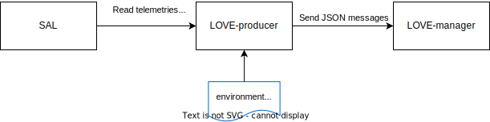

..
    This file is part of LOVE-producer.
..
    Copyright (c) 2023 Inria Chile.
..
    Developed by Inria Chile.
..
    This program is free software: you can redistribute it and/or modify it under 
    the terms of the GNU General Public License as published by the Free Software 
    Foundation, either version 3 of the License, or at your option any later version.
..
    This program is distributed in the hope that it will be useful,but WITHOUT ANY
    WARRANTY; without even the implied warranty of MERCHANTABILITY or FITNESS FOR 
    A PARTICULAR PURPOSE. See the GNU General Public License for more details.
..
    You should have received a copy of the GNU General Public License along with 
    this program. If not, see <http://www.gnu.org/licenses/>.

********
Overview
********

Introduction
------------

The LOVE-producer is part of the LSST Operators Visualization Environment (L.O.V.E).
It provides the necessary communication system to conect the LOVE-manager and SAL.
It produce DDS messages to LOVE for one or more components of the LSST system.

It is a Python package and uses :code:`asyncio` and the :code:`salobj` library to handle asynchronous communication between the LOVE-manager and SAL.
It generates a websocket client, reads telemetries and events from SAL and then produces the messages to be sent to the LOVE-manager server.
The producer is configured with the name and the salindex of a specific CSC in order to connect to the respective `salobj.Remote`.

Configurations
--------------

Three environment variables must be set to allow the producer communicate with SAL and the LOVE-manager:

- :code:`LSST_DDS_PARTITION_PREFIX`: Used by :code:`salobj` to filter SAL messages in the network.
- :code:`PROCESS_CONNECTION_PASS`: Password used by the LOVE-manager to allow the reception of messages from the LOVE-producer.
- :code:`WEBSOCKET_HOST`: Hostname or IP address of the LOVE-manager service.

How to run
----------

To run a love producer you need first to export the environment variables described above. Then you need to execute the following commands:

.. code-block:: bash

    $ pip install <love_producer_folder>
    $ run_love_producer --components <csc_name>:<salindex> --log-level <log_level>

You need to first install the package from :code:`<love_producer_folder>` which is the root folder of the code.
Then to run one (or more) producer(s) use the :code:`run_love_producer` with the :code:`--components` argument.
The :code:`<csc_name>` is the name of the CSC and :code:`<salindex>` is the salindex of the CSC, if running more than one producer just use a comma separated list with the previously described params.
You can also configure the logging level with the :code:`--log-level` argument where :code:`<log_level>` is the log level in numeric form.

